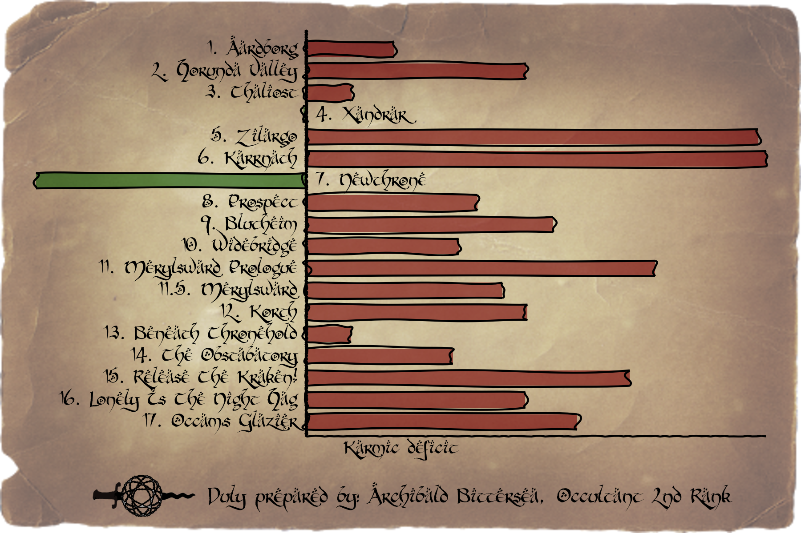

```{r setup, include=FALSE}
knitr::opts_chunk$set(echo = FALSE, warning = FALSE, message = FALSE)
oharac::setup()
library(tidyverse)
library(tidytext)
library(xkcd)
library(cowplot)
library(magick)
library(showtext)
font_add(family = 'hobbit', regular = '/Library/Fonts/hobbitonbrushhand.ttf')
showtext_auto()
```

### Process reports

Using `afinn` lexicon, score each report over time using a cumulative sum.  The reports all trend downward using raw scores, indicating an overall negative tone.  To help account for this, there is a `pos_adj` parameter that calculates the ratio of `abs(sum(neg) / sum(pos))`.  Multiplying the positive scores by (some fraction of) this parameter helps boost those scores in relation to negative scores.

```{r}
fs <- list.files('reports', full.names = TRUE)

rpts <- lapply(fs, FUN = function(f) {
  ### f <- fs[1]
  ftype <- str_extract(f, '\\..+')
  x <- switch(ftype, 
              .txt = scan(f, what = 'character'),
              .rtf = textreadr::read_rtf(f))
  y <- data.frame(txt = x)
}) %>%
  setNames(basename(fs)) %>%
  bind_rows(.id = 'chapter') 

rpts_tidy <- rpts %>%
  unnest_tokens(word, txt, 'words') %>%
  group_by(chapter) %>%
  mutate(word_num = 1:n(),
         tot_words = n(),
         ch_num = str_extract(chapter, '[0-9]+') %>% as.numeric(),
         ch_num = ifelse(str_detect(chapter, '11b'), 11.5, ch_num)) %>%
  ungroup()

zeros <- rpts_tidy %>%
  group_by(chapter, ch_num) %>%
  slice(1) %>%
  mutate(word_num = 0, value = 0)

rpts_scored <- rpts_tidy %>%
  anti_join(stop_words) %>%
  inner_join(get_sentiments('afinn'))

### calculate a scaling factor for positive scores - 
### half the scale necessary to achieve parity of scores
v <- rpts_scored$value
# summary(v)
# mean(v); sd(v)
pos_adj <- 0.7 * abs(sum(v[v<0]) / sum(v[v>0]))

rpts_summed <- rpts_scored %>%
  mutate(value = ifelse(value > 0, value * pos_adj, value)) %>%
  bind_rows(zeros) %>%
  group_by(chapter) %>%
  arrange(chapter, word_num) %>%
  mutate(sum_sent = cumsum(value),
         wds_norm = word_num / max(word_num),
         sum_length_adj = sum_sent / max(word_num)) %>%
  ungroup() %>%
  mutate(sum_norm = sum_length_adj / max(abs(sum_length_adj)))

rpts_done <- rpts_summed %>%
  mutate(ch_name = chapter %>% 
           str_replace_all('.+[0-9-]+[ab]?|\\..+', '') %>%
           str_trim() %>%
           str_to_title()) %>%
  ungroup() %>%
  arrange(ch_num) %>%
  mutate(ch_name = fct_inorder(ch_name))

write_csv(rpts_done, 'chapter_storylines.csv')
```

### Plot storylines 

For each mission, chart out the cumulative sum of 'karmic balance' - using word count as a metric of time.

```{r}
get_bkgd <- function(file = 'img/vellum1.png',
                     ht, wd, dpi = 300, 
                     opacity = 20, color = 'white') {
  bkgd <- image_read(file) %>%
    image_trim() %>%
    image_resize(sprintf('%sx%s!', wd*dpi, ht*dpi)) %>%
    image_colorize(opacity, color)
  return(bkgd)
}

footer <- ggdraw() +
  draw_image(image_read('img/stabacus.png') %>%
               image_rotate(180), x = 0, width = .2) +
  draw_text('Duly prepared by: Archibald Bittersea, Occultant 2nd Rank',
            x = .2, hjust = 0, size = 12, family = 'hobbit')


```


```{r storyline plot}
  
rpts_done <- read_csv('chapter_storylines.csv') %>%
  arrange(ch_num) %>%
  mutate(ch_name = fct_inorder(ch_name))

lbls <- rpts_done %>%
  group_by(ch_name, ch_num) %>%
  summarize(final_sum = last(sum_norm),
            words = max(word_num)) %>%
  ungroup() %>%
  mutate(label = sprintf('%s. %s', ch_num, ch_name),
         score = sprintf('Karmic %s: %s', 
                         ifelse(final_sum > 0, 'surplus', 'deficit'),
                         round(abs(final_sum) * 100)))

### the crossing (instead of just a simple data.frame) allows for
### each storyline to have a unique axis...
x_axis <- crossing(lbls, x = seq(0, 1, .01)) %>%
  mutate(y = runif(n(), -.01, .01))
y_axis <- crossing(lbls, y = seq(-1, 1, .01)) %>%
  mutate(x = runif(n(), -.002, .002))

storyline_plot <- ggplot(rpts_done, aes(x = wds_norm, y = sum_norm)) +
  geom_path(data = x_axis, aes(x = x, y = y), color = 'black') +
  geom_path(data = y_axis, aes(x = x, y = y), color = 'black') +
  # geom_vline(xintercept = 0, color = 'red') +
  geom_line(color = 'grey20', size = 0.8) +
  geom_line(aes(color = sum_norm), size = .5, show.legend = FALSE) +
  scale_color_gradient2(low = 'red', mid = 'paleturquoise1', high = 'black') +
  facet_wrap(~ch_name, ncol = 2) +
  theme_void() +
  theme(strip.background = element_blank(),
        strip.text = element_blank(),
        text = element_text(family = 'hobbit'),
        plot.margin = unit(c(.5, .5, .5, .5), 'cm')) +
  geom_text(data = lbls, x = .99, y = 0.8, aes(label = label), 
            family = 'hobbit',
            hjust = 1, vjust = 1) +
  geom_text(data = lbls, x = .01, y = -.95, aes(label = score), 
            family = 'hobbit',
            hjust = 0, vjust = 0)

ht = 7; wd = 6; dpi = 300
plot_on_bkgd <- ggdraw() +
  draw_image(get_bkgd('img/vellum1.png', 
                      ht = ht, wd = wd, dpi = dpi,
                      opacity = 10, color = 'brown') %>%
               image_blur(radius = 5, sigma = 3)) +
  draw_plot(storyline_plot, y = .1, height = .9) +
  draw_plot(footer, y = 0.02, height = .1, x = .1, width = .8)

ggsave('storyline_by_chapter.png', width = wd, height = ht, dpi = dpi)

knitr::include_graphics('storyline_by_chapter.png')
```

### Plot karmic balance by chapter

A bar chart showing the team's final karmic balance for each chapter

```{r barplot}

bars_df <- lbls %>%
  mutate(ch_name = fct_rev(ch_name),
         ch_id = as.integer(ch_name),
         score = -final_sum) %>%
  mutate(y_val = ifelse(final_sum > 0, .02, -.02),
         y_just = ifelse(final_sum > 0, 0, 1),
         deficit = score > 0)

x_axis <- data.frame(x = seq(0, nrow(bars_df) + .5, .01)) %>%
  mutate(y = runif(n(), -.002, .002))
y_range <- range(bars_df$score)
y_axis <- data.frame(y = seq(0, 1, .01)) %>%
  mutate(x = runif(n(), -.02, .02))

karma_bar_plot <- ggplot() +
  xkcdrect(data = bars_df, aes(xmin = ch_id -.7, xmax = ch_id,
                            ymax = score, ymin = 0, fill = deficit),
           alpha = .6, show.legend = FALSE) +
  scale_fill_manual(values = c('darkgreen', 'darkred')) +
  geom_path(data = x_axis, aes(x = x, y = y), color = 'black') +
  geom_path(data = y_axis, aes(x = x, y = y), color = 'black') +
  theme_void() +
  scale_y_continuous(expand = c(.01, 0)) +
  scale_x_continuous(expand = c(.01, .01),
                     breaks = bars_df$ch_id, labels = bars_df$label) +
  geom_text(data = bars_df, 
            aes(label = label, x = ch_id, y = y_val, hjust = y_just),
            vjust = 1, family = 'hobbit') +
  coord_flip() +
  theme(text = element_text(family = 'hobbit'),
        axis.title.x = element_text(family = 'hobbit', hjust = .5),
        plot.margin = unit(c(.5, .5, .5, .5), 'cm')) +
  labs(y = 'Karmic deficit')

ht = 4; wd = 6; dpi = 300
plot_on_bkgd <- ggdraw() +
  draw_image(get_bkgd('img/vellum2.png', 
                      ht = ht, wd = wd, dpi = dpi,
                      opacity = 40)) +
  draw_plot(karma_bar_plot, y = .1, height = .9) +
  draw_plot(footer, y = .02, height = .1, x = .1, width = .8)

ggsave('karma_barplot.png', width = wd, height = ht, dpi = 300)


```